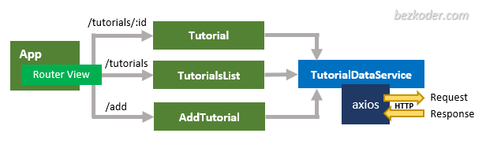

# django-mongodb

CRUD

- mongodb
- django rest framework
- Vue

#### get started

###### backend
- `python3 -m venv venv`
- `source venv/bin/activate`
- `pip install -r requirements.txt`
- `python manage.py runserver 8080`

###### frontend
- `cd frontend`
- `cd vue-js-client-crud`
- `npm run serve`

|Methods    |Urls               |Actions                    |
|-----------|-------------------|---------------------------|
|POST       |/api/tutorials     | create new Tutorial       |
|GET	    |/api/tutorials	    |retrieve all Tutorials     |
|GET	    |/api/tutorials/:id	|retrieve a Tutorial by :id |
|PUT	    |/api/tutorials/:id	|update a Tutorial by :id   |
|DELETE	    |/api/tutorials/:id	|delete a Tutorial by :id   |
|DELETE	    |/api/tutorials	    |delete all Tutorials       |
|GET	    |/api/tutorials?title=[keyword] |	find all Tutorials which title contains keyword|

https://bezkoder.com/django-mongodb-crud-rest-framework/
https://bezkoder.com/vue-js-crud-app/

for more: https://bezkoder.com/